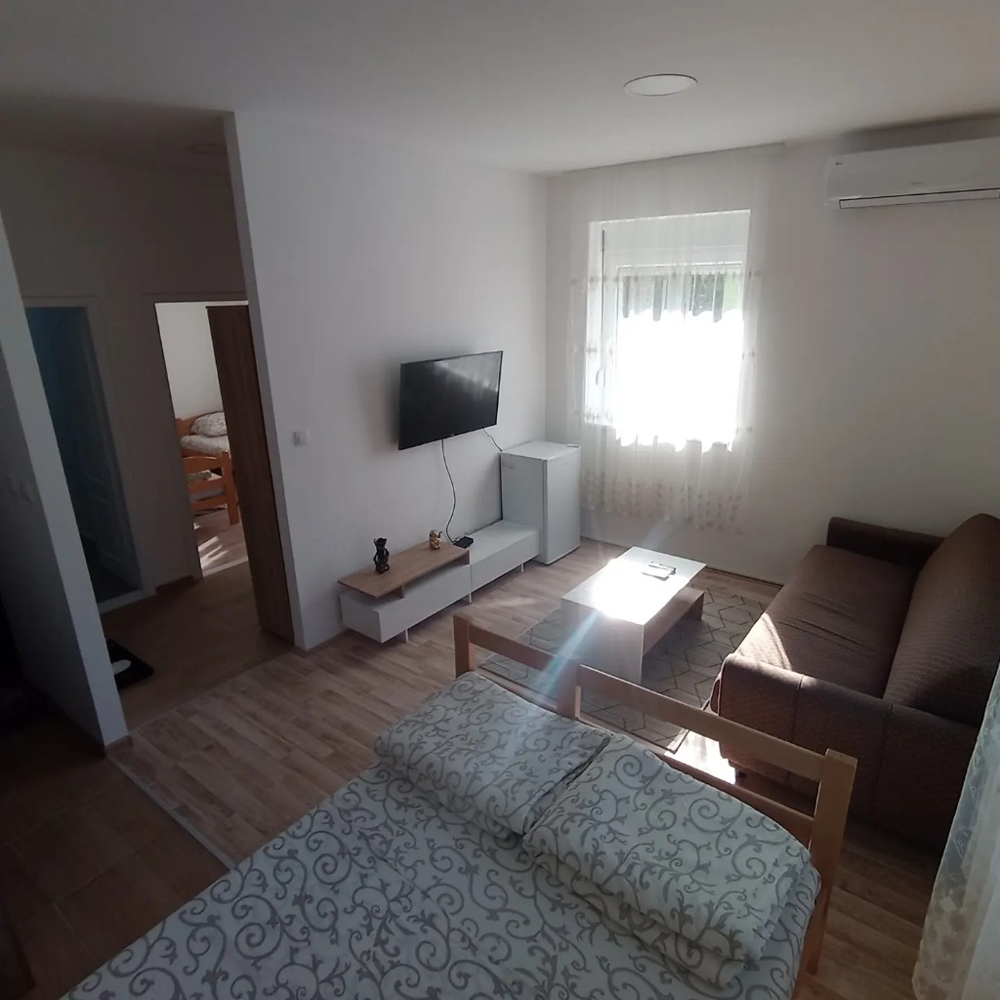

# Apartmani BAN — Vrbas

Statički višejezični (SR/EN) sajt za ugostiteljski objekat **Apartmani BAN**
u Vrbasu. Bez build-procesa — otvorite `index.html` ili poslužite folder
bilo kojim statičkim serverom.

```
.
├── index.html        # struktura stranice (semantic HTML)
├── styles.css        # design system + komponente + responsive
├── script.js         # i18n (default SR), mobilni drawer, scroll-spy
├── assets/
│   └── logo.png      # zvanični logo (navy + gold)
└── README.md
```

## Brzo pokretanje

```bash
# Opcija 1 — Python
python3 -m http.server 8080
# Opcija 2 — Node
npx serve .
```

---

## Sadržaj sajta i izvori podataka

Svi opisi, broj kreveta, sadržaji i recenzije su preuzeti sa zvanične
[Booking.com stranice **BAN apartmani**](https://www.booking.com/hotel/rs/ban.html).

| Sekcija | Sadržaj |
| ------- | ------- |
| Hero    | Logo + 9.7 ocena · 112 utisaka · 1.2 km do centra · E-75 par km |
| Apartmani | **3 apartmana** — One-Bedroom Apartment (Booking), Standard Apartment (Booking · do 4 osobe) i **Treći apartman** (van Booking-a, slike se dodaju ručno) |
| Sadržaji | Parking, Wi-Fi, klima, kuhinjsko niše, peškiri/toaletni set, vodič po komšiluku |
| Lokacija | Ise Sekickog 63, 21460 Vrbas (lat 45.5680, lon 19.6572) + tačan embed mape |
| Recenzije | **10 verifikovanih utisaka** sa Booking.com — svaka kartica je klikabilna i vodi direktno na sekciju recenzija na Booking.com |
| CTA banner | `Rezerviši na Booking.com` + tel `+381 64 127 6269` |

### Šta NIJE na sajtu (po zahtevu klijenta)
- Bilo kakvo pominjanje **buke / tišine / mira / mirne lokacije**.
- **Streaming servisi** (TV se pominje samo kao funkcija opreme).

### Treći apartman — slike se dodaju ručno
Treći apartman nije listiran na Booking-u. Trenutno koristi placeholder
("Slike uskoro"). Da dodate fotografije, otvorite `index.html`, pronađite
komentar `APARTMAN 3 — slike se unose ručno.` i zamenite
`<div class="card__media card__media--placeholder">…</div>` sa:

```html
<div class="card__media">
  
</div>
```

Smestite sliku u `assets/apt3.jpg` (ili druga imena). CTA za treći
apartman ide na `tel:+381641276269` (poziv direktno).

---

## Design System

### 1. Tipografija — *Major Third* (1.25×), baza 16px

| Element | Size | Line-height | Letter-spacing |
| ------- | ---- | ----------- | -------------- |
| `p`     | 16px               | 150% | 0       |
| `h6`    | 20px (1.25rem)     | 140% | -0.5%   |
| `h5`    | 25px (1.5625rem)   | 135% | -0.8%   |
| `h4`    | 31.25px (1.953rem) | 130% | -1.2%   |
| `h3`    | 39.06px (2.441rem) | 120% | -1.5%   |
| `h2`    | 48.83px (3.052rem) | 110% | -1.8%   |
| `h1`    | 61.04px (3.815rem) | 100% | -2%     |

Fontovi: **Fraunces** (display) + **Inter** (UI).

### 2. Grid

| Breakpoint | Kolone |
| ---------- | ------ |
| Desktop (`> 1024px`) | **12** |
| Tablet  (`641–1024px`) | **8** |
| Mobile  (`≤ 640px`)   | **4** |

### 3. Spacing — multiples of 8

`--s-1 = 8px` → `--s-16 = 128px`. Sve `padding/margin/gap` koristi ove tokene.

### 4. Color palette — preuzeta sa logoa (60-30-10)

| Uloga | % | Vrednost | Job |
| ----- | - | -------- | --- |
| **Primary (60%)**   | 60 | `#F6EFE0` topla krem + `#0E1B3F` deep navy (iz logoa) | Pozadina i tekst |
| **Secondary (30%)** | 30 | `#0E1B3F` / `#07112B` navy varijante | Tamne sekcije, CTA banner, footer |
| **Accent (10%)**    | 10 | `#C9A26B` gold (iz logoa) | CTA dugmići, akcenti, eyebrowi |

### 5. Contrast (provereno)

| Par | Ratio |
| --- | ----- |
| `#0E1B3F` na `#F6EFE0` | **15.5 : 1** ✓ AAA |
| `#FFFFFF` na `#0E1B3F` | **17.6 : 1** ✓ AAA |
| `#0E1B3F` na `#C9A26B` (gold CTA dugme) | **6.9 : 1** ✓ AAA large / AA body |

> Napomena: gold dugmad **uvek** koriste tamni navy tekst, ne beli — beli na zlatnom ne prolazi WCAG (~2.5:1).

---

## Conversion strategy

Sajt ima jedan glavni cilj — **rezervacija preko Booking.com**. CTA su raspoređeni tako da budu uvek vidljivi:

1. **Nav** (gore-desno) — `Rezerviši`
2. **Hero** — `Rezerviši na Booking.com` (primary) + `Pogledaj apartmane` (secondary)
3. **About card** — `Pročitaj sve utiske →` (link na Booking recenzije)
4. **Apartment cards** (po jedan na svakoj) — `Rezerviši na Booking.com`
5. **Gallery** — svaka slika linkuje na Booking foto galeriju
6. **Reviews** — svaka od 10 kartica linkuje na Booking recenzije
7. **Final CTA banner** — `Rezerviši na Booking.com` + `tel:` link
8. **Footer** — Booking.com card
9. **Mobilna sticky bottom traka** — uvek vidljiv "Pozovi" + "Rezerviši"

---

## Mobile optimizacija

- **Hamburger meni** (off-canvas drawer u navy boji) — uključuje sve linkove, CTA, telefon i SR/EN.
- **Sticky bottom bar** na telefonu sa `Pozovi` + `Rezerviši na Booking.com` (uvek dostupno).
- Sva CTA dugmad imaju **min. 48px visine** (Apple/Google tap-target minimum).
- Hero metrika prelazi iz 4 kolone u 2 kolone na mobilnom.
- Apartman kartice se slažu vertikalno; lista sadržaja ostaje 2 kolone radi gustine.
- Galerija prelazi sa 6 kolona → 3 (tablet) → 2 (mobile).
- Reviews → 3 → 2 → 1 kolona.
- Footer 4 kolone → 2 → 1 kolona.
- `viewport-fit=cover` + `env(safe-area-inset-bottom)` za iPhone notch / home indicator.
- `prefers-reduced-motion` poštovan — sve tranzicije se gase.

---

## i18n (SR default, EN opcionalno)

Sve prevodne tačke imaju `data-i18n="key"` atribut, mapa je u `script.js`
(`I18N.sr`, `I18N.en`). **Sajt se pri prvom dolasku otvara na srpskom.**
Korisnikov izbor se pamti u `localStorage` (`ban_lang`).

## Kontakt

**Đorđe** — vlasnik objekta · `+381 64 127 6269` · [Booking.com](https://www.booking.com/hotel/rs/ban.html)
